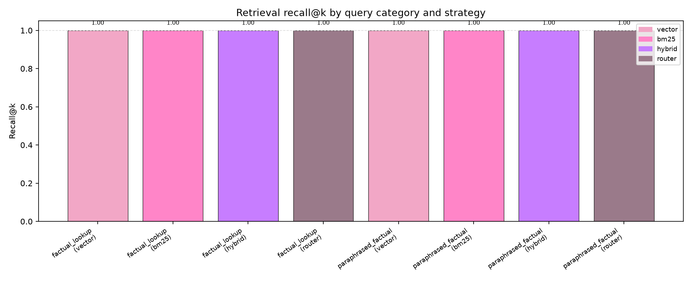

# rag-system

One repo for **serving**, **evaluating**, and **routing** retrieval — not two cousins that never share an index.

Most RAG demos stop at “upload a PDF, ask a question.” This project measures whether retrieval actually helps, compares vector vs BM25 vs hybrid fusion, and routes queries to the strategy that fits the question shape.

## Architecture

```text
ingest (API) ──► shared in-memory index
                    ├── Chroma vectors
                    └── BM25 sparse mirror
                         │
query (API) ──► router ──┬── vector
                         ├── bm25
                         ├── hybrid (RRF)
                         └── router (rule-based classifier)

eval (API/CLI) ──► same metrics harness
                    ├── recall@k, MRR, nDCG
                    ├── faithfulness + citation coverage
                    └── metrics_by_category
```

| Path | Role |
|------|------|
| `api/` | FastAPI service — ingest, query, stats, eval, eval history |
| `eval/` | Benchmark harness, metrics, BM25/hybrid/router, sample corpus |
| `results/` | API eval history (`history.jsonl`) |
| `eval/results/` | Committed benchmark artifacts + chart |

## Results (sample corpus, 2 questions)



| Strategy | Recall@k | MRR | nDCG@k | Notes |
|----------|----------|-----|--------|-------|
| vector | 1.0 | 0.75 | 0.815 | Finds both docs; paraphrase ranks lower |
| bm25 | 1.0 | 1.0 | 1.0 | Keyword overlap on tiny eval set |
| hybrid | 1.0 | 0.75 | 0.815 | RRF balances sparse + dense |
| router | 1.0 | 1.0 | 1.0 | Routes paraphrase → bm25, lookup → bm25 |

Per-category breakdown lives in `eval/results/hybrid_by_category.json`.

## Quick start

```powershell
cd rag-system
python -m venv .venv
.\.venv\Scripts\activate
pip install -r requirements.txt

# tests
$env:HF_HOME = "$PWD\.hf_cache"
.\.venv\Scripts\python.exe -m pytest api/tests eval/tests -q

# API
$env:HF_HOME = "$PWD\.hf_cache"
.\.venv\Scripts\uvicorn.exe api.app.main:app --reload --app-dir api

# standalone eval (vector | bm25 | hybrid | router)
$env:HF_HOME = "$PWD\.hf_cache"
.\.venv\Scripts\python.exe eval/scripts/run_eval.py --config eval/configs/default.yaml --strategy hybrid

# regenerate benchmark JSON + chart
$env:HF_HOME = "$PWD\.hf_cache"
.\.venv\Scripts\python.exe scripts/regenerate_benchmarks.py
```

### API endpoints

| Method | Path | Purpose |
|--------|------|---------|
| `GET` | `/health` | Liveness |
| `GET` | `/stats` | Chunk count + sources |
| `POST` | `/ingest` | Upload text, upsert chunks |
| `POST` | `/query` | Retrieve + answer (`strategy` optional, defaults to `router`) |
| `POST` | `/eval` | Run eval harness on live index |
| `GET` | `/eval/history` | Past eval runs |

## Query categories

Defined in `eval/configs/query_categories.yaml` — factual lookup, paraphrased factual, multi-hop, ambiguous, exact-term/acronym, out-of-domain. The rule-based router in `eval/src/retrieval/router.py` maps category → strategy using Phase 4 benchmarks.

## Roadmap

- [ ] Learned router (replace regex heuristics)
- [ ] Larger labeled eval set (10+ questions per category)
- [ ] Shared persistent index (SQLite / disk Chroma) for multi-session demos
- [ ] Weights & Biases export for experiment tracking

## Origin

Merged from [rag-api](https://github.com/vedantrazjpurohit-create/rag-api) and [rag-eval-bench](https://github.com/vedantrazjpurohit-create/rag-eval-bench).

**Stack:** Python 3.11+ · FastAPI · ChromaDB · sentence-transformers · pytest